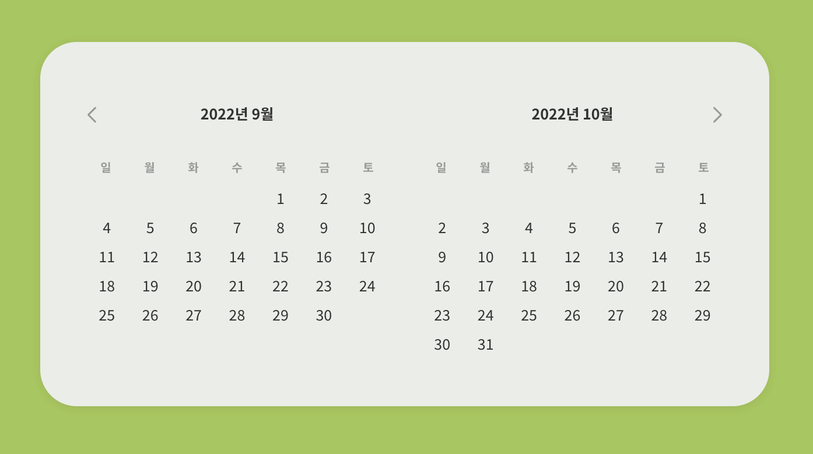

# Sliding Calendar
## 미리보기

## 설명
이전 버튼(<)이나 이후 버튼(>)을 클릭하면 이전 달이나 다음 달의 달력을 보여줍니다.
달력이 넘어갈 때는 슬라이딩 되는 transition 반영되었습니다.

달력은 한번에 2달씩 보여집니다.
이전으로 이동할 경우 앞쪽에 더 이전의 달력이 앞쪽에 추가되며, 이후로 이동할 경우 더 이후의 달력이 뒤쪽에 추가됩니다.

## 참고자료
- [airbnb - 날짜 선택 모달](https://www.airbnb.co.kr/)